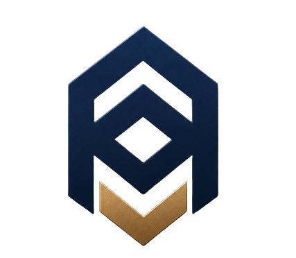
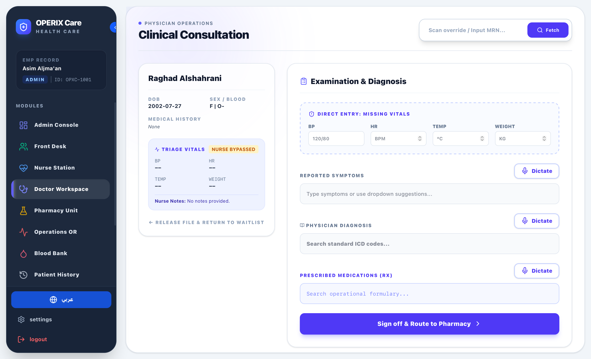
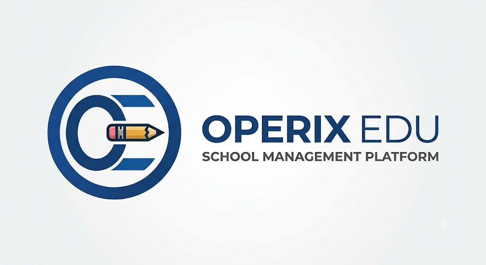

  
  
  <h1 style="border-bottom: none; margin-bottom: 0;">OPERIX 249</h1>
  
<strong>Sudanese Enterprise Command & Control Suite</strong>

  

	
	
	
  

 

## 🌐 Corporate Overview

**OPERIX 249** is the sovereign enterprise ecosystem dedicated to the Sudanese market. Developed by [OPERIX Solutions](https://www.operix-solutions.com), this infrastructure provides high-performance, resilient digital operations that bridge human capital, financial oversight, and logistical orchestration into a single pane of glass.

Built for absolute continuity in challenging environments, OPERIX 249 ensures that critical business, medical, and educational sectors run flawlessly through 99.9% uptime architecture.

---

## ⚡ Core Operational Platforms

Our systems are designed to be deployed standalone or as a fully integrated enterprise bundle.

###  **OPERIX Operations**
The central nervous system of your business. Replaces manual logbooks with live fleet matrices, gig-workforce deployment tracking, and Geofenced shift orchestration.
> **Key Capabilities:** *Live Telemetry • ANPR Camera Integration • AI-Powered Executive Dashboard*

###  **OPERIX FMIS**
Corporate Ledger System engineered for precise financial command. Integrates automated budget loops, dynamic P&L telemetry, and full integration with regional treasury standards.
> **Key Capabilities:** *ZATCA Phase 1 & 2 Compliant • Smart Quotation Builder • AI Financial Copilot*

###  **OPERIX HRIS**
Advanced Human Capital Infrastructure. Complete automation of the employee lifecycle, from AI-driven CV scanning to GPS-fenced timesheets and Muqeem Visa tracking.
> **Key Capabilities:** *Kanban ATS • Automated Payroll Deductions • Digital Master Profiles*

---

## 🏥 Vertical Industry Solutions

<table>
  <tr>
	<td width="50%" align="center">
	  
	    
	  <b> Shifa Care</b>
	  
Advanced hospital management ecosystem. End-to-end clinical workflows covering patient triage, voice-dictated diagnostics, live blood bank monitoring, and surgical scheduling.

	</td>
	<td width="50%" align="center">
	  
	    
	  <b> OPERIX Edu</b>
	  
Cloud-based school management platform purpose-built for Middle Eastern academic standards. Handles fee collection, automated GPA rendering, and parent communication.

	</td>
  </tr>
</table>

---

## 🏆 Featured Integrations & Deployments

Our infrastructure currently powers leading institutions and corporate initiatives:

*   **Esnad Enterprise:** Institutional resource planning and digital archiving portal.
*   **Hased Community:** Smart real estate hub managing resident billing and facilities.
*   **Mamey Platform:** General trading and logistics management for South Sudanese imports.

---

## 🔒 Security & Data Sovereignty
*   **Impenetrable Ledgers:** Financial transactions and HR disciplinary actions are stored in immutable databases.
*   **Enterprise IAM:** Granular Identity and Access Management with strict C-Suite overriding capabilities.
*   **Resilient Uptime:** Global Edge CDN deployment ensures localized data routing and protection against terrestrial network interruptions.

 

  <h3>Ready to Modernize Your Enterprise?</h3>
  

	<a href="https://www.operix-solutions.com/contact">Contact Solutions Team</a> • 
	<a href="mailto:sudan.office@operix-solutions.com">Email Sudan Office</a>
  

  
<i>© 2026 OPERIX Solutions. All systems operational.</i>

